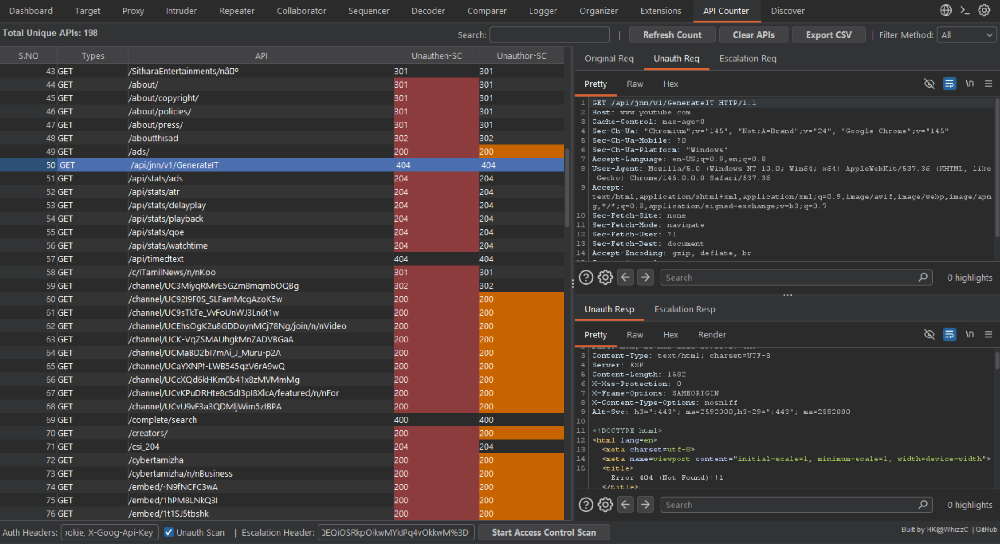

# 🛡️ AuthMatrix Pro
**Automated Broken Access Control (BAC) & IDOR Testing Suite for Burp Suite**

## 📖 Description
**AuthMatrix Pro** is a professional-grade Burp Suite extension designed for HOODIES and penetration testers to streamline API security audits. It eliminates the manual effort of verifying **Broken Access Control (BAC)** and **IDOR** vulnerabilities across complex API surfaces by providing a comparative, color-coded matrix of results.

By performing dual-vector scanning—simultaneously testing for unauthenticated access and cross-user privilege escalation—it provides a clear visualization of an application's security posture.

---

## ✨ Key Features
* **Automatic API Discovery:** Passively maps unique `Method + Path` signatures from Proxy and Repeater traffic as you browse.
* **Dual-Vector Scanning Engine:**
    * **Unauth Scan:** Automatically strips specified session headers to identify unprotected endpoints.
    * **Escalation Scan:** Dynamically replaces high-privilege headers with user-supplied low-privilege/victim tokens to test for Vertical and Horizontal Escalation.
* **Comparative Analysis Dashboard:** Side-by-side status code columns (**Unauthen-SC** vs. **Unauthor-SC**) to instantly visualize security gaps.
* **Deep Inspection Suite:** A 5-tab viewer system allows for frame-by-frame comparison of **Original**, **Unauthenticated**, and **Escalated** request/response pairs.
* **Smart Triage:** Includes numerical S.NO sorting, method-based filtering, and real-time keyword searching.
* **UTF-8 Export:** Generate clean, report-ready CSV exports that preserve special characters in API paths.

---

## 🚀 Installation
1.  **Requirement:** Ensure **Jython Standalone** is configured in Burp Suite (**Extensions** > **Options** > **Python Environment**).
2.  **Download:** Save the `Api_Counter.py` file from this repository.
3.  **Load:** In Burp, navigate to **Extensions** > **Installed** > **Add**. Select **Extension Type: Python** and select the file.

---

## 🛠️ How to Use

### 1. Discovery
Simply browse the target application. **AuthMatrix Pro** passively identifies unique API endpoints. Use the search bar or method dropdown to filter your target list.

### 2. Configuration
* **Auth Headers:** Enter the names of headers to be removed for the unauthenticated check (e.g., `Cookie, Authorization`).
* **Escalation Header:** Provide the full header string for a lower-privileged user or victim (e.g., `Cookie: session=low_priv_token`).

### 3. Execution & Visualization
Click **Start Access Control Scan**. The tool will process all identified APIs in the background.

  

* **Status Indicators:**
    * **Red Cells (Unauthen-SC):** The endpoint is accessible without any authentication (e.g., returns 200 OK).
    * **Orange Cells (Unauthor-SC):** A potential **Privilege Escalation** or **IDOR** has been detected (the low-privilege token accessed high-privilege data).

### 4. Manual Verification (Context Menu)
**Right-click** any row to instantly verify findings in Repeater with pre-configured headers:
* **Send Original to Repeater**
* **Send Unauth to Repeater** (Headers pre-stripped)
* **Send Escalation to Repeater** (Token pre-replaced)

---

## 📄 License
This project is licensed under the MIT License.

## 👤 Credits
Developed by **[CV1523](https://github.com/CV1523)** (HK@WhizzC).
